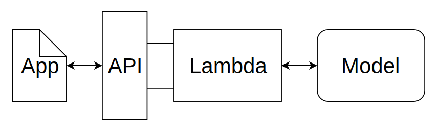
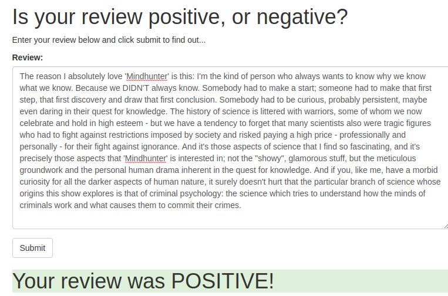

# SageMaker Deployment Project

## Info
The notebook `SageMaker Project.ipynb` and Python files provided here result in a simple web app which interacts with a deployed recurrent neural network performing sentiment analysis on movie reviews. 

This project uses Amazon SageMaker to manage training and deployment, Pytorch for model-building and validation, AWS Lambda for pre-processing and envoking deployed model enpoint, and AWS REST API for sending post request with a movie review to AWS Lambda.

 

Provided notebook provides step-by-step documentation of the process, as not all steps can be done programatically, and require dabbling in AWS Console.

## Result

The result is a simple website app, that sends a post request to AWS Lambda function, and returns a binary output `0/1` that is then interpreted and formatted to give feedback about a sentiment of a movie review;

